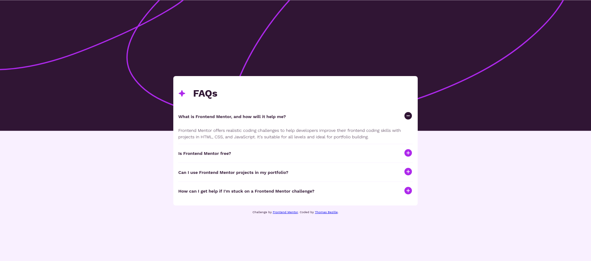
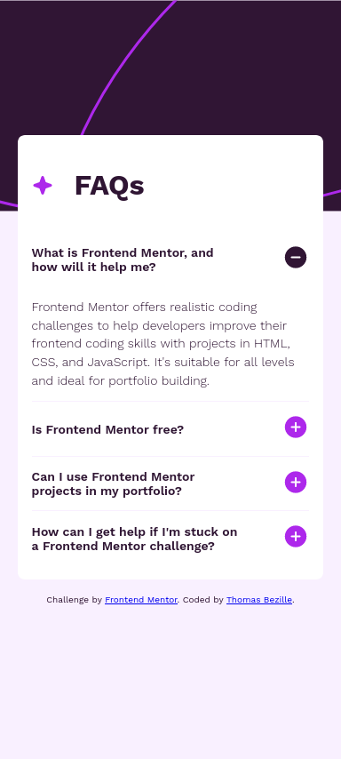

# Frontend Mentor - FAQ accordion solution

This is a solution to the [FAQ accordion challenge on Frontend Mentor](https://www.frontendmentor.io/challenges/faq-accordion-wyfFdeBwBz). Frontend Mentor challenges help you improve your coding skills by building realistic projects.

## Table of contents

- [Frontend Mentor - FAQ accordion solution](#frontend-mentor---faq-accordion-solution)
  - [Table of contents](#table-of-contents)
  - [Overview](#overview)
    - [The challenge](#the-challenge)
    - [Screenshot](#screenshot)
    - [Links](#links)
  - [My process](#my-process)
    - [Built with](#built-with)
  - [Author](#author)

## Overview

### The challenge

Users should be able to:

- Hide/Show the answer to a question when the question is clicked
- View the optimal layout for the interface depending on their device's screen size
- See hover and focus states for all interactive elements on the page

### Screenshot

### Links

- [Github](https://github.com/Thomas-Bezille/FrontEnd-Mentor_FAQ-accordion)
- [Live](https://front-end-mentor-faq-accordion-peach.vercel.app/)

## My process

### Built with

- HTML
- CSS
- SCSS
- JavaScript

## Author

- Frontend Mentor - [@Thomas-Bezille](https://www.frontendmentor.io/profile/Thomas-Bezille)
- Twitter - [@ThomasBzie](https://twitter.com/ThomasBzie)
